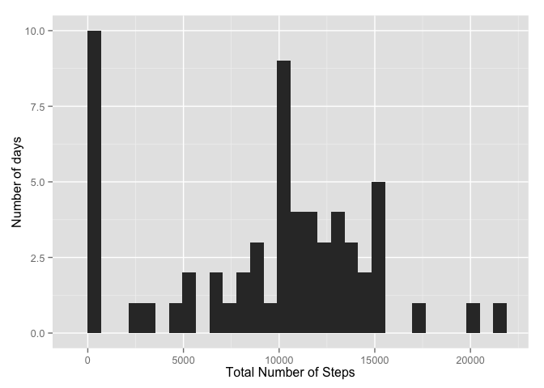
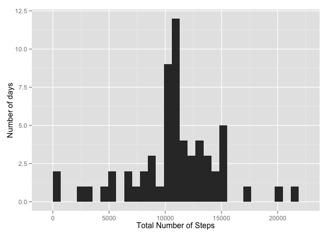
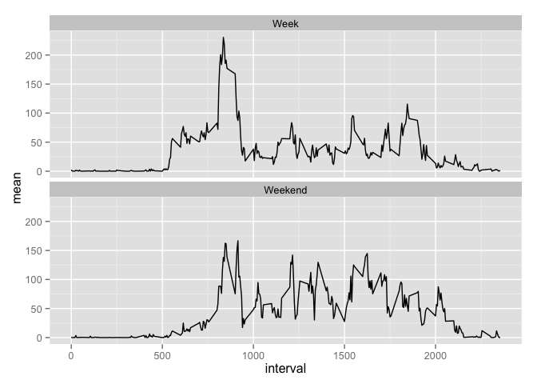

# Reproducible Research: Peer Assessment 1


## Loading and preprocessing the data


```r
getwd()
```

```
## [1] "/Users/steffenhartleib/CourseraReproducibleResearch/RepData_PeerAssessment1"
```

```r
raw <- read.csv("activity.csv")
```

## What is mean total number of steps taken per day?

```r
stepsDay <- aggregate(raw$steps, by = list(raw$date), FUN = sum, na.rm = TRUE)
names(stepsDay) <- c('Date', 'TotalSteps')
stepsDay
```

```
##          Date TotalSteps
## 1  2012-10-01          0
## 2  2012-10-02        126
## 3  2012-10-03      11352
## 4  2012-10-04      12116
## 5  2012-10-05      13294
## 6  2012-10-06      15420
## 7  2012-10-07      11015
## 8  2012-10-08          0
## 9  2012-10-09      12811
## 10 2012-10-10       9900
## 11 2012-10-11      10304
## 12 2012-10-12      17382
## 13 2012-10-13      12426
## 14 2012-10-14      15098
## 15 2012-10-15      10139
## 16 2012-10-16      15084
## 17 2012-10-17      13452
## 18 2012-10-18      10056
## 19 2012-10-19      11829
## 20 2012-10-20      10395
## 21 2012-10-21       8821
## 22 2012-10-22      13460
## 23 2012-10-23       8918
## 24 2012-10-24       8355
## 25 2012-10-25       2492
## 26 2012-10-26       6778
## 27 2012-10-27      10119
## 28 2012-10-28      11458
## 29 2012-10-29       5018
## 30 2012-10-30       9819
## 31 2012-10-31      15414
## 32 2012-11-01          0
## 33 2012-11-02      10600
## 34 2012-11-03      10571
## 35 2012-11-04          0
## 36 2012-11-05      10439
## 37 2012-11-06       8334
## 38 2012-11-07      12883
## 39 2012-11-08       3219
## 40 2012-11-09          0
## 41 2012-11-10          0
## 42 2012-11-11      12608
## 43 2012-11-12      10765
## 44 2012-11-13       7336
## 45 2012-11-14          0
## 46 2012-11-15         41
## 47 2012-11-16       5441
## 48 2012-11-17      14339
## 49 2012-11-18      15110
## 50 2012-11-19       8841
## 51 2012-11-20       4472
## 52 2012-11-21      12787
## 53 2012-11-22      20427
## 54 2012-11-23      21194
## 55 2012-11-24      14478
## 56 2012-11-25      11834
## 57 2012-11-26      11162
## 58 2012-11-27      13646
## 59 2012-11-28      10183
## 60 2012-11-29       7047
## 61 2012-11-30          0
```
### Histogram of the total number of steps taken each day

```r
require(ggplot2)
ts <- ggplot(stepsDay, aes(TotalSteps))
ts + geom_bar() + ylab("Number of days") + xlab("Total Number of Steps")
```

 

### mean and median of the total number of steps per day


```r
meanStepsDay <- mean(stepsDay$TotalSteps)
medianStepsDay <- median(stepsDay$TotalSteps)
meanMed <- data.frame(meanStepsDay, medianStepsDay)
meanMed
```

```
##   meanStepsDay medianStepsDay
## 1         9354          10395
```

## What is the average daily activity pattern?

```r
avgInt <- aggregate(raw$steps, by = list(raw$interval), FUN = mean, na.rm = TRUE)
plot(x = avgInt$Group.1, y = avgInt$x, ylab = "Average Number of Steps", xlab = "5 Min Interval", type = "l" )
```

 

### Which 5-minute interval, on average across all the days in the dataset, contains the maximum number of steps?


```r
maxStepInt <- subset(avgInt, x==max(avgInt$x))[1]
names(maxStepInt) <- c("Int. Start Minute")
maxStepInt
```

```
##     Int. Start Minute
## 104               835
```

## Imputing missing values

### Calculate and report the total number of missing values in the dataset 

```r
dim(raw)[1] - sum(complete.cases(raw),na.rm = TRUE)
```

```
## [1] 2304
```

### Replace missing values in the dataset 

- Strategy: replace NA with mean steps for the interval
- calculate the mean for each interval 
- Duplicate the steps column for NA replacement (keep original steps column)
- Replace Na's in Duplicate steps column
- check 


```r
require(plyr)
meanRaw <- ddply(raw,.(interval), summarize, mean=mean(steps,na.rm=TRUE))
raw$stepsNaR <- raw$steps
raw$stepsNaR[is.na(raw$stepsNaR)] <- meanRaw$mean[match(raw$interval,meanRaw$interval)][is.na(raw$stepsNaR)]
length(raw$stepsNaR[(is.na(raw$stepsNaR))])
```

```
## [1] 0
```


### Create a new dataset with the missing data filled in


```r
rawNaR <- raw[,-1]
names(rawNaR)[3] <- "steps"
str(rawNaR)
```

```
## 'data.frame':	17568 obs. of  3 variables:
##  $ date    : Factor w/ 61 levels "2012-10-01","2012-10-02",..: 1 1 1 1 1 1 1 1 1 1 ...
##  $ interval: int  0 5 10 15 20 25 30 35 40 45 ...
##  $ steps   : num  1.717 0.3396 0.1321 0.1509 0.0755 ...
```

### Histogram of the total number of steps taken each day (NA's replaced)


```r
stepsDayNaR <- aggregate(rawNaR$steps, by = list(rawNaR$date), FUN = sum, na.rm = TRUE)
names(stepsDayNaR) <- c('Date', 'TotalSteps')
require(ggplot2)
ts2 <- ggplot(stepsDayNaR, aes(TotalSteps))
ts2 + geom_bar() + ylab("Number of days") + xlab("Total Number of Steps")
```

 

### Mean and median total number of steps taken per day after NA replacment  


```r
meanStepsDayNaR <- mean(stepsDayNaR$TotalSteps)
medianStepsDayNaR <-median(stepsDayNaR$TotalSteps)
mComp <- data.frame(mean = c(meanStepsDay,meanStepsDayNaR), 
                    median = c(medianStepsDay,medianStepsDayNaR),
                    row.names = c("With NAs", "NAs Replaced"))
mComp
```

```
##               mean median
## With NAs      9354  10395
## NAs Replaced 10766  10766
```
### Do these values differ from the estimates from the first part of the assignment? 

The mean increased from 9,354 to 10,766. Interestingly the mean and median are the same once Na's are replaced.

### What is the impact of imputing missing data on the estimates of the total daily number of steps?

```r
totalStepsAdded <- sum(stepsDayNaR$TotalSteps) - sum(stepsDay$TotalSteps)
percIncrease <- (sum(stepsDayNaR$TotalSteps) - sum(stepsDay$TotalSteps))/sum(stepsDay$TotalSteps)
NaRImpact <- data.frame(totalStepsAdded, percIncrease)
NaRImpact
```

```
##   totalStepsAdded percIncrease
## 1           86130       0.1509
```
Replacing the Na's' added 86k steps, or 15%

## Are there differences in activity patterns between weekdays and weekends?

### Create a 2 level factor variable: “weekday” and “weekend” 


```r
rawNaR$Weekday <- ifelse(weekdays(as.Date(rawNaR$date)) %in% c("Saturday", "Sunday"), "Weekend", "Week")
```

### Panel plot: Weekend vs weekday average steps per interval 


```r
require(ggplot2)
meanRawNaRWk <- ddply(rawNaR,.(interval, Weekday), summarize, 
                           mean=mean(steps,na.rm=TRUE))
g <- ggplot(meanRawNaRWk, aes(interval, mean))
g + geom_line() + facet_wrap(~Weekday, ncol=1) 
```

 
